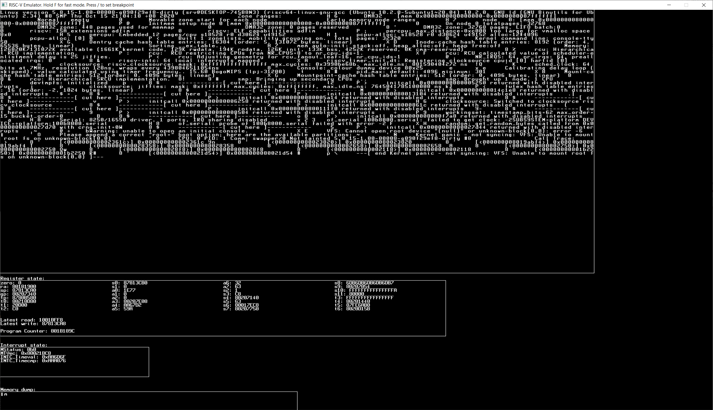

# A RISC-V emulator written in BlitzMax NG

^^^ The thing booting Linux. Bug with "initcall 0x... returned with interrupts disabled" has since been fixed.

---

This emulator emulates a single-core RV64IMAFD machine. It uses a [cached interpreter](https://ps1.asuramaru.com/emulator-development/cached-interpreters) technique to achieve more speed.

It is not finished by any means. There's a lot of missing functionality (see list below) and a lot of optimizations to be implemented. Also a lot of bugs to fix.

[UserspaceEmulator series by Andreas Kling served as great inspiration](https://www.youtube.com/watch?v=NVPavP9DP-c)

### Missing features:
- Some sort of actual I/O; We need to emulate at least an 8250 serial port
- Interrupt support is very very rudimentary
- Some instructions are still missing
