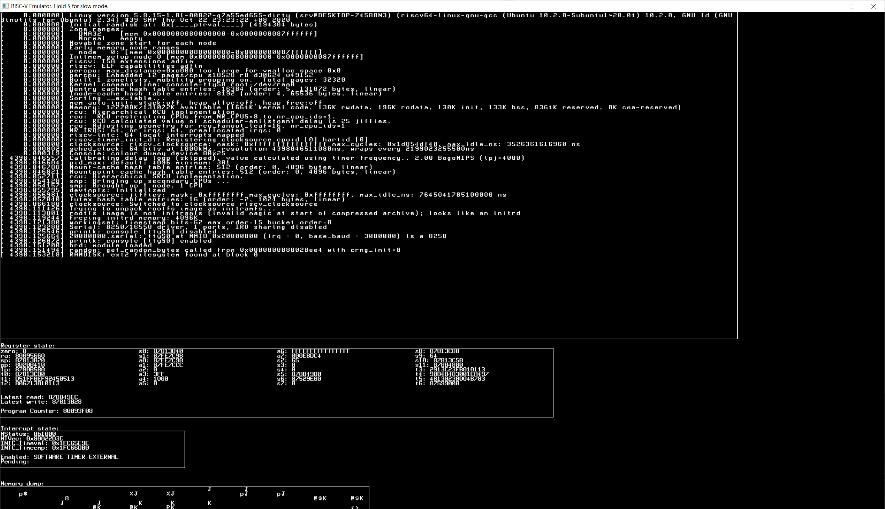

# A RISC-V emulator written in BlitzMax NG

^^^ The thing booting Linux; it has successfully detected the filesystem in the initd image.

---

This emulator emulates a single-core RV64IMA machine. It is capable of running NOMMU builds of Linux. Unfortunately, you can't do much with it. NOMMU Linux on RISC-V currently doesn't support loading ELF files (!!!), only FLAT binaries. [ELF support _may_ be added in the future](https://linuxplumbersconf.org/event/4/contributions/386/attachments/298/502/RISC-V-NOMMU-Linux-Plumbers-2019.pdf), but for now it can't run anything really.

You would probably be better off using [QEMU](https://risc-v-getting-started-guide.readthedocs.io/en/latest/linux-qemu.html)

See [this repository](https://github.com/AXKuhta/RISC-V_Emulation_supplementals) for the kernel binaries

[UserspaceEmulator series by Andreas Kling served as great inspiration](https://www.youtube.com/watch?v=NVPavP9DP-c)

### Missing features:
- Some sort of actual I/O; We need to emulate at least an 8250 serial port
- Interrupt support is very very rudimentary
- Some instructions are still missing
